# Memoria robot E-puck autónomo potenciado con algoritmos evolutivos

Javier Morales Galisteo

# Índice

Introducción
Función fitness
Arquitectura artificial neuronal estática
Red neuronal 1
Modificación 1
Modificación 2
Modificación 3
Modificación 4
Modificación 5
Observaciones
Red neuronal 2
Modificación 1
Modificación 2
Modificación 3
Modificación 4
Modificación 5
Modificación 6
Observaciones
Arquitectura artificial neuronal dinámica
Modificación 1
Modificación 2
Observaciones
Conclusiones

# Introducción

En el presente documento presentamos el desarrollo e implementación de una red neuronal sobre un robot E-Puck como el que se puede observar en la Imagen 1. Para ello emplearemos el simulador IRSIM proporcionado en la asignatura de IRIN de la ETSIT UPM.

El comportamiento de nuestro E-puck consiste en una versión simplificada del anterior trabajo realizado en la asignatura. Este trabajo consistía en diseñar, mediante una arquitectura basada en el comportamiento, un robot autónomo capaz de localizar fuegos, apagarlos, y rescatar a personas en peligro.

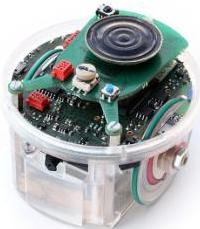
Imagen 1

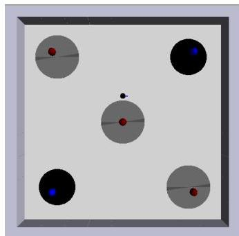
Imagen 2

En la versión simplificada que emplearemos en este proyecto nos centraremos en la primera funcionalidad mencionada. Es decir, iniciaremos el robot en un entorno vacío, sin obstáculos, con la excepción de fuentes de luz rojas y azules, así como sensores de suelo grises y negros como se puede observar en la Imagen 2.

La luz roja y el suelo gris están vinculados y representan focos de fuego, mientras que la luz azul y el suelo negro, que también están vinculados, representan ubicaciones de extintores. De esta forma podremos centraremos exclusivamente en la funcionalidad que queremos que el robot realice. Esta se va a basar en que el robot detecte fuegos y vaya a coger un extintor.

Debido a la complejidad que supone trabajar con robótica evolutiva, al contar con numerosos operadores que afectan al resultado de los algoritmos genéticos, decidimos centrarnos en esta versión simplificada de las funcionalidades de nuestro proyecto anterior.

La robótica evolutiva es una técnica para la configuración automática de robots autónomos mediante el uso de algoritmos evolutivos como es el caso de los algoritmos genéticos, los cuales emplean principios inspirados en la evolución biológica. Los robots van a evolucionar a lo largo de las generaciones mediante operadores como la reproducción, el cruce, la mutación y el elitismo. Mediante una función de fitness, los individuos son evaluados para indicar qué tan eficaz es un robot en la tarea que se le ha encomendado. Los mejores individuos, según su fitness, tendrán una mayor probabilidad de ser seleccionados para transmitir sus parámetros a la siguiente evolución, permitiendo de esta forma una mejora progresiva del comportamiento de los robots.

# Función fitness

La función fitness es un componente esencial en los algoritmos evolutivos empleados en la robótica evolutiva, pues es la encargada de evaluar el rendimiento de cada individuo de la generación en la realización de una tarea determinada.

El objetivo fundamental de esta función es clasificar a los individuos de una generación para que a la hora de formar una nueva generación, se reproduzcan los que mejor desempeño han demostrado.

Para la realización de este trabajo, hemos desarrollamos la siguiente función fitness para evaluar a los robots:

$$
F = \frac {\sum_ {i = 0} ^ {N_{steps}} \left[ \left[ V \cdot \left(1 - \sqrt {\Delta V}\right) \cdot \left(1 - \max  \{I R _ {i} \}\right) \cdot \left(M _ {R} \cdot M _ {L}\right) \right] \cdot \left[ GM_{ON} \cdot \left(\frac{\sum_{j=0}^{N_{sensors}} BL_{j}}{N_{sensors}} - \begin{cases} (\max \{RL_{i}\} - 0.5) & \text{si } \max \{RL_{i}\} > 0.93 \\\\ 0 & \text{si no} \end{cases} \right) \right] + G M _ {O F F} \cdot \left(\frac {\sum_ {j = 0} ^ {N_{sensors}} R L _ {j}}{N_{sensors}}\right)  \right] }{N_{steps}} \cdot \left(\frac {F _ {o b j}}{2 0}\right)
$$

- $V$ Evalúa que el robot se mueva rápido
- $\left(1 - \sqrt{\Delta V}\right)$ Evalúa que las ruedas del robot se muevan a la misma velocidad
- $\left(1 - \max \{I R_{i}\}\right)$ Evalúa que el robot no se acerca a los obstáculos
- $\left(M_{R} \cdot M_{L}\right)$ Evalúa que ambas ruedas estén activas
- $GM_{ON} \cdot \left(\frac{\sum_{j=0}^{N_{sensors}} BL_{j}}{N_{sensors}} - \delta\right)$ Evalúa que en el caso de haber "agarrado un objeto" (pasar por una baldosa gris), el robot se dirija hacia la luz azul y no se acerque excesivamente a la luz roja, siendo $\delta$:

$$\delta = \begin{cases} (\max\{RL_{i}\} - 0.5) & \text{si } \max\{RL_{i}\} > 0.93 \\\\ 0 & \text{si no} \end{cases}$$

- $GM_{OFF} \cdot \left(\frac{\sum_{j=0}^{N_{sensors}} RL_{j}}{N_{sensors}}\right)$ Evalúa que en el caso de no tener “agarrado un objeto” (pasar por una baldosa negra), el robot se dirija hacia la luz roja
- $\left(\frac{F_{obj}}{20}\right)$ Promueve que el robot vaya cambiando de luz objetivo, penalizando si permanece mucho tiempo buscando la misma luz

La función fitness está depende de numerosos parámetros que acaban siendo altamente restrictivos con el propósito de que las evoluciones convergan hacia soluciones viables y adaptadas a la tarea a desempeñar, evitando así comportamientos no funcionales o evoluciones subóptimas.

Una de las consecuencias directas asociadas a la restrictividad que presenta, es que el valor que ésta va a tomar va a ser bajo (esto también depende de otros factores como la arquitectura empleada, etc.).

# Arquitectura artificial neuronal estática

Entre las diferentes arquitecturas neuronales existentes, encontramos las redes estáticas. Estas se caracterizan por presentar una arquitectura fija, en la que las interconexiones entre las distintas capas no se ven modificadas a lo largo del tiempo de ejecución. Para esta primera parte del trabajo vamos a centrarnos en este tipo de redes neuronales, puesto que suponen un primer acercamiento a la robótica evolutiva.

La principal desventaja que presenta desarrollar una arquitectura estática, es que ni retiene información evolutiva entre generaciones ni permite la adaptación dinámica de la función fitness. Esto supone una gran limitación a la hora de generar y evolucionar a los robots.

La estrategia a seguir consiste en dejar evolucionar al robot un centenar de generaciones y ver los resultados que obtenemos. Tras el análisis de estos resultados, realizaremos las modificaciones y ajustes necesarios para que el E-puck evolucione de la forma más óptima posible hacia la tarea que le planteamos.

# Red neuronal 1

Hemos desarrollado una primera red neuronal que se puede ver a continuación:

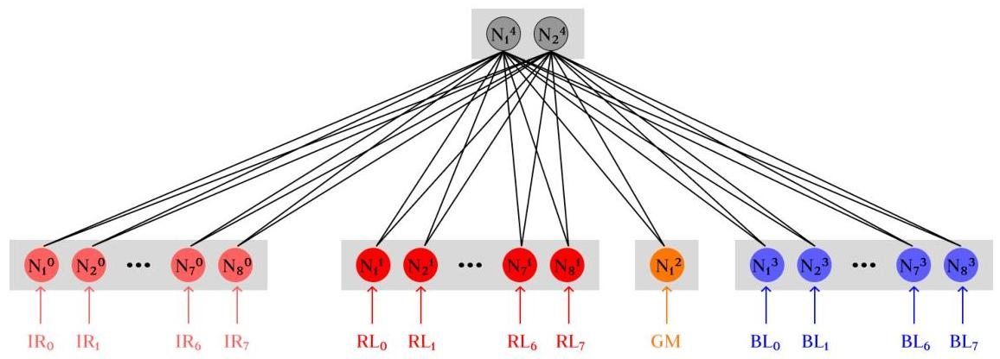

Como se puede apreciar en el gráfico, se trata de una red simple con pocas capas en la que su mayoría son capas de identidad. Las capas identidad recogen la información proporcionada por los sensores de infrarrojos, luz roja y azul, y de suelo con memoria, y se la enviarán a la capa sigmoide que controla las dos ruedas del E-puck.

El número de cromosomas que tendremos a causa de la red planteada se calcula de la siguiente manera:

- $\omega = (8 \cdot 2) + (8 \cdot 2) + (1 \cdot 2) + (8 \cdot 2) = 50$
- $\theta = 2$

Por lo que podemos afirmar que el tamaño del cromosoma es de 52.

Vamos a emplear la fitness function vista anteriormente para suplir la tarea planteada de detectar un fuego e ir a por un extintor, y vamos a realizar diversas modificaciones hasta llegar a un punto en el que el robot realice correctamente el funcionamiento.

# Modificación 1

En esta primera modificación empezamos la evolución con los siguientes operadores:

- Population size = 50
- Evaluation time = 300
- Mutation rate = 0.02

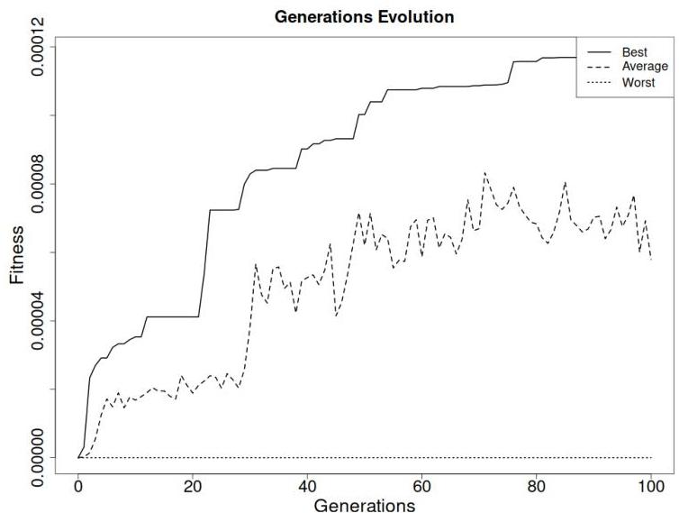

Tras la evolución de 100 generaciones, y aunque los valores de la fitness sean muy bajos, observamos que la fitness evoluciona progresivamente como se puede apreciar en la gráfica aunque con algún pequeño estancamiento. El mejor valor de la fitness es de 0.0001182.

Ahora vamos a hacer un análisis del movimiento que realiza el robot.

# Prueba 1

Primero lo ejecutamos en el mismo escenario en el que ha evolucionado.

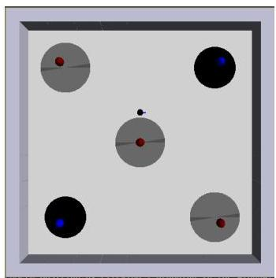

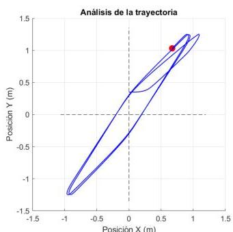

Observamos que sigue correctamente el objetivo propuesto, es decir, va hacia la luz roja, luego hacia la azul y no presenta ninguna colisión. La trayectoria que dibuja es igual durante toda la ejecución como se puede apreciar en la gráfica, por lo que parece que es un movimiento "aprendido". Para comprobar esta hipótesis ejecutamos más pruebas.

## Prueba 2

Eliminamos la luz roja junto con su suelo gris asociado situados en el centro de coordenadas para forzar al robot a cambiar de movimiento y no pasar por el centro.

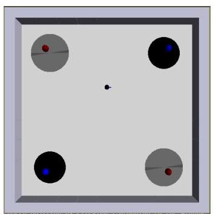

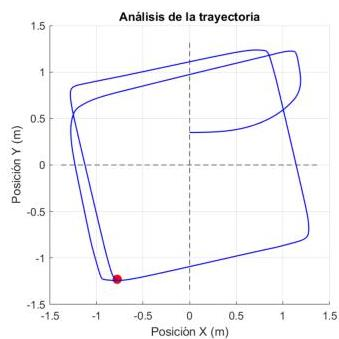

Ejecutamos nuevamente el simulador y obtenemos una trayectoria distinta a la anterior, por lo que podemos concluir que el robot recoge y procesa la información de sus sensores de luz y de suelo. No obstante, la nueva trayectoria seguida también es repetitiva como se aprecia en la gráfica.

## Prueba 3

Para salir de dudas, y comprobar si cambia nuevamente de recorrido ante el cambio de escenario, ahora además eliminamos la luz azul junto a su suelo negro situado arriba a la derecha.

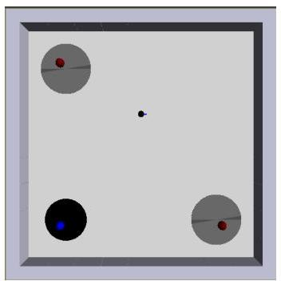

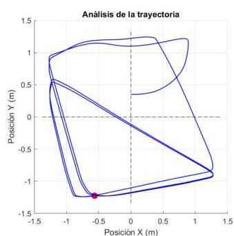

El resultado que dibuja el es diferente a los dos anteriores como se aprecia en la gráfica. Sin embargo, esta vez en ocasiones realiza un movimiento diferente al esperado hasta llegar a las fuentes de luz

## Modificación 2

Vamos a modificar el resultado de la evolución anterior. Puesto que la evolución ha sufrido leves estancamientos, aumentamos la mutación rate al 5% para así aumentar la diversidad genética y que se reduzcan los periodos de máximos. Seguimos evolucionando desde donde está y dejamos que evolucione 100 generaciones más.

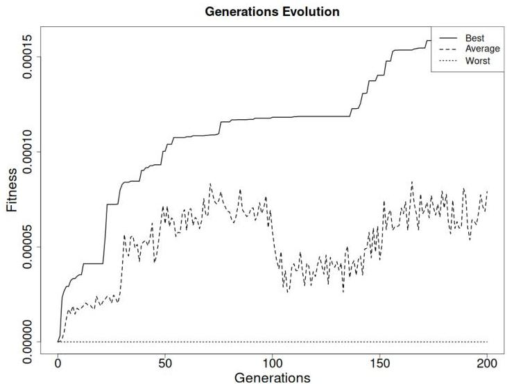

En la evolución de la fitness, aunque también se aprecian periodos de estancamiento, se ha producido una mejora de la fitness, llegando a una máxima de 0.00015947 en las últimas generaciones. Nuevamente analizamos el resultado de la mejor generación.

## Prueba 1

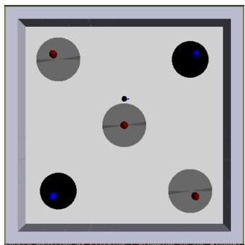

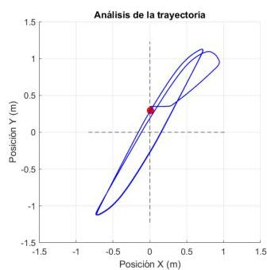

Ante el mismo escenario que el de la evaluación, el comportamiento es correcto, realizando movimientos nuevamente diagonales.

## Prueba 2

Probamos a eliminar la luz roja y su suelo gris del centro para forzar que cambie de movimiento.

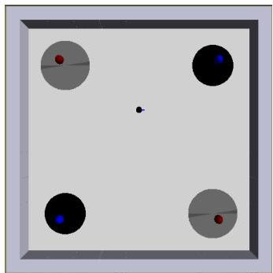

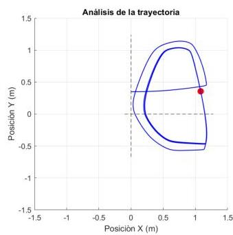

No realiza bien el objetivo puesto que cuando se dirige hacia la luz roja, a pesar de que se acerca mucho a la zona gris, no llega a pasar por ella, y en vez de acercarse nuevamente y pasar por encima, vuelve hacia la luz azul.

# Modificación 3

Al seguir teniendo estancamientos en la evolución de la fitness, aumentamos la población de 50 a 75 para que haya una mayor probabilidad de tener individuos con mejor fitness. Además, para que aparezca una mayor influencia de los sensores forzamos a que cada vez que se evalúa, el robot empiece en una posición y orientación aleatoria dentro de un área delimitada.

Dejamos que evolucione 200 generaciones más con estas modificaciones.

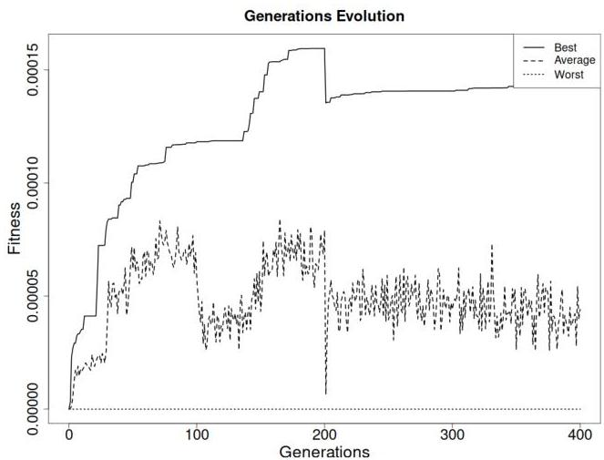

Los resultados de la fitness obtenidos son inferiores a los de la anterior modificación, alcanzando esta vez una fitness de 0.00014314. Este decremento es esperable, puesto que al iniciar en una posición aleatoria, la fitness va a aumentar muy lentamente. Además de que también tiene una tasa de mutación y un tamaño de población elevados.

# Prueba 1

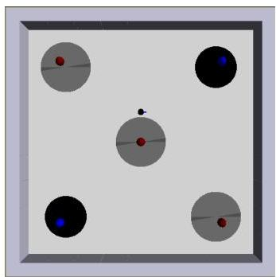

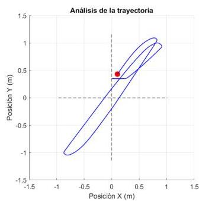

Nuevamente, al poner al robot a interactuar con el entorno en el que ha evolucionado, se obtienen comportamientos correctos pero repetitivos, realizando siempre una diagonal entre las luces azules existentes y la luz roja del origen.

# Prueba 2

Probamos eliminar la luz roja junto con su suelo gris del centro de la arena.

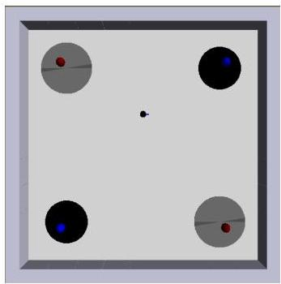

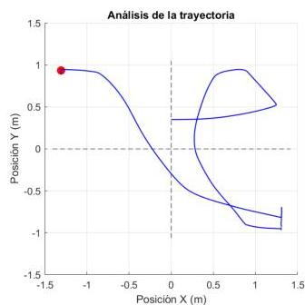

El resultado obtenido no cumple con el objetivo esperado. El robot se queda chocando contra las paredes de forma continuada, y realiza movimientos extraños que quedan lejos de lo que debería hacer.

# Modificación 4

Puesto que tras esta generación, el robot ha empeorado significativamente, vamos a volver a la situación final de la "Modificación 2". Esta vez vamos a activar únicamente la aparición en una posición y orientación random dentro de un área delimitada.

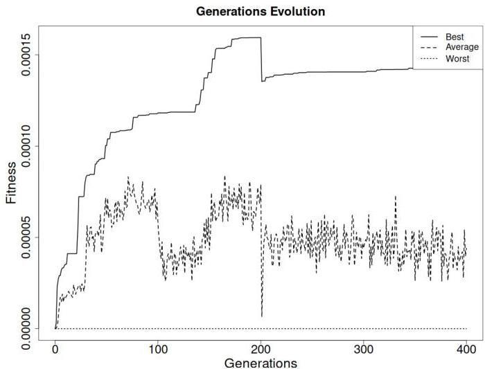

Notamos que la fitness tiene un crecimiento lento en las últimas generaciones, llegando a un valor máximo de 0.00014314.

Vamos a realizar las mismas pruebas que antes para comprobar que esta vez el robot tenga un comportamiento más correcto.

## Prueba 1

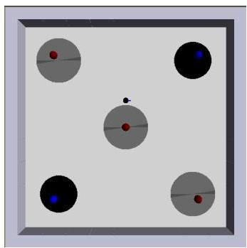

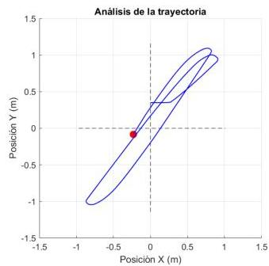

Realiza el mismo movimiento diagonal ante el escenario inicial.

## Prueba 2

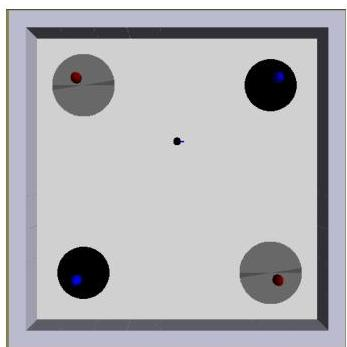

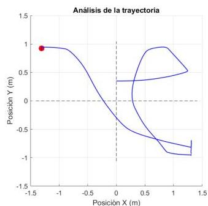

Ante la ausencia de la luz roja y el suelo gris asociado situados en el centro, el robot tampoco es capaz de salir de esta situación, realizando movimientos alejados de los esperados.

## Modificación 5

Volvemos a deshacer los cambios y nos situamos nuevamente en la situación final de la "Modificación 2", ya que la evolución del desempeño del E-puck no ha mejorado. Ahora vamos a probar a aumentar únicamente el tamaño de la población a 75 individuos.

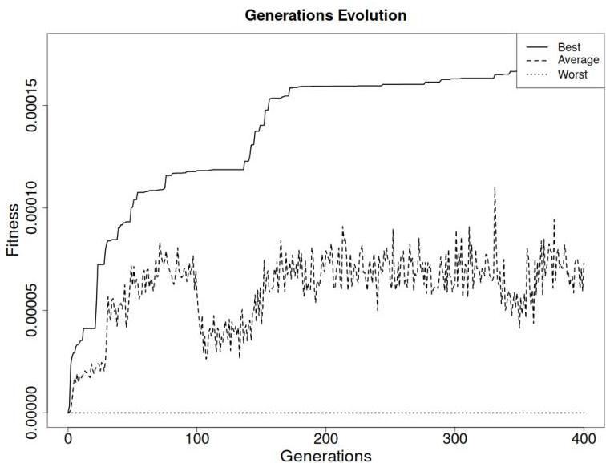

Esta vez hemos obtenido una mejora en la fitness alcanzando un valor de 0.000178. Este valor es el mayor alcanzado hasta este momento.

Nuevamente, realizamos las mismas pruebas para ver si se ha conseguido mejorar la interacción del robot con el entorno.

## Prueba 1

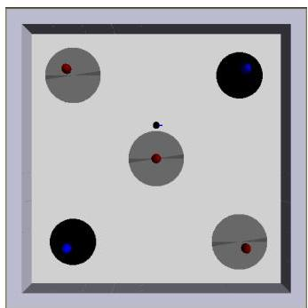

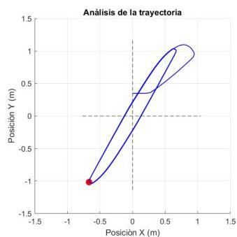

El movimiento que describe el robot sigue siendo el mismo, un movimiento diagonal que pasa por dos fuentes de luz azul y una roja.

## Prueba 2

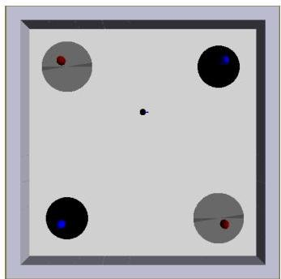

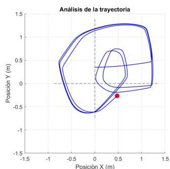

Aunque se aprecia una leve mejora, ya que por lo menos parece que busca la luz roja en el centro del mapa, en vez de quedarse en un bucle chocando contra una pared. Este comportamiento no es correcto puesto que no hay luz alguna en el centro y el robot no es capaz de dirigirse a las otras fuentes de luz roja existentes en el escenario.

## Observaciones

El valor de la fitness ha sido muy bajo, cosa que era de esperar, pero los movimientos que ha presentado el robot han estado muy lejos de lo esperable. Esto se puede deber a la simplicidad de esta red neuronal, ya que únicamente hay una capa sigmoide con dos salidas.

Con el objetivo de tener un resultado más favorable, vamos a descartar esta primera red neuronal y la vamos a sustituir por una más compleja.

# Red neuronal 2

En esta segunda red neuronal hemos elevado la complejidad añadiendo una capa oculta de sigmoides con cuatro salidas, que se ocupará de procesar la información obtenida por los sensores de luz roja y azul, y de suelo con memoria, para luego enviarlo a la capa sigmoide encargada de manejar los motores.

La arquitectura que emplearemos es la siguiente:

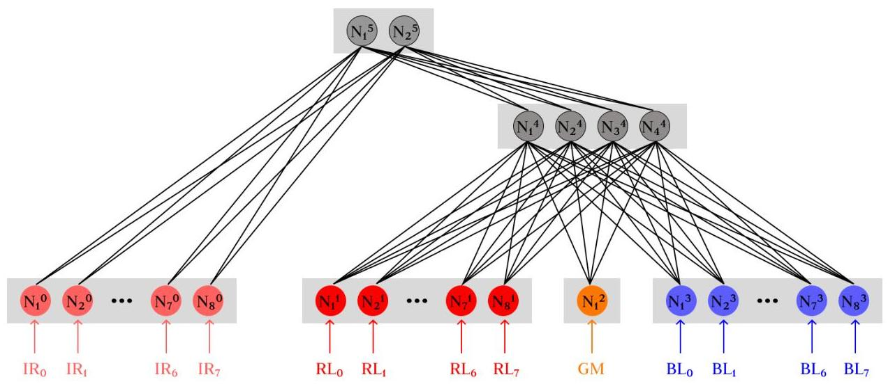

El número de cromosomas que tendremos a causa de la red planteada lo calculamos de la siguiente manera:

- $\omega = (8 \cdot 2) + (8 \cdot 4) + (1 \cdot 4) + (8 \cdot 4) + (4 \cdot 2) = 92$
- $\theta = 4 + 2 = 6$

El resultado de sumar los pesos con los sesgos nos confirma que la longitud del cromosoma de esta red neuronal es de 98. Lo que supone un incremento del 88.64% respecto a la anterior arquitectura.

En las siguientes evoluciones, emplearemos también la función fitness detallada anteriormente.

# Modificación 1

En esta primera modificación empezamos la evolución con los siguientes operadores:

- Population size = 50
- Evaluation time = 300
- Mutation rate = 0.02

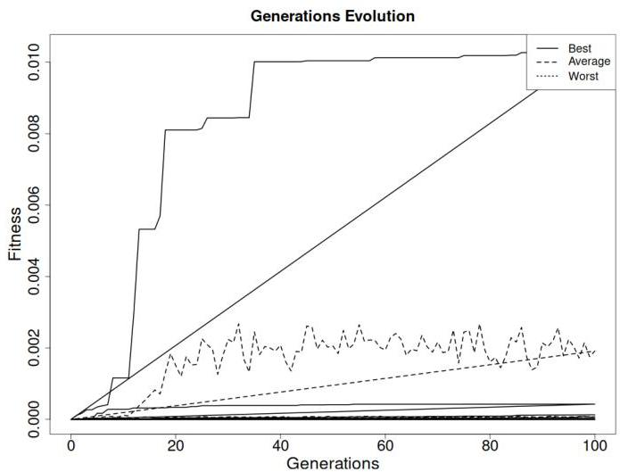

Tras la evolución de 100 generaciones, y aunque los valores de la fitness sean muy bajos, observamos que la fitness evoluciona progresivamente como se puede apreciar en la gráfica. El mejor valor de la fitness es de 0.00012829.

Fijándonos únicamente en el valor de la fitness, si lo comparamos con el valor obtenido en la “Modificación 1” de la primera arquitectura, notamos que ha mejorado, lo que nos permite suponer que el cambio de arquitectura era necesario. No obstante, haremos distintas modificaciones para intentar mejorar el desempeño del E-puck.

Ahora vamos a hacer una análisis al movimiento que realiza el robot.

## Prueba 1

Iniciaremos la primera prueba de comportamiento en el mismo escenario en el que se ha evaluado y evolucionado al robot.

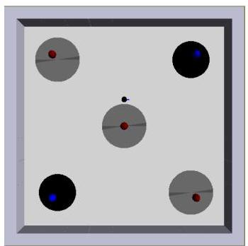

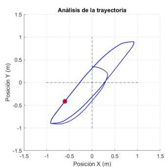

La trayectoria descrita se puede observar en la gráfica que es correcta, aunque realiza siempre el mismo recorrido diagonal.

# Prueba 2

Para comprobar que no sea un movimiento “aprendido” a causa de realizar las evoluciones en la misma posición, eliminamos la luz roja y el suelo gris del origen de coordenadas, y ejecutamos nuevamente el simulador.

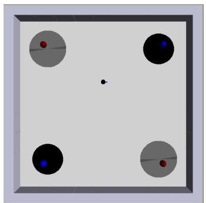

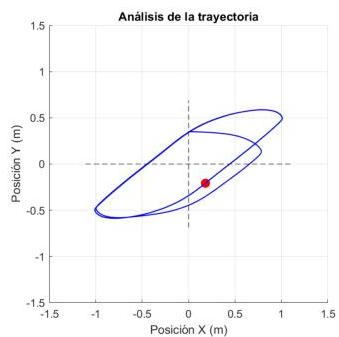

Notamos que la trayectoria no ha cambiado, sino que sigue realizando la misma diagonal sin pasar por ninguna luz roja

# Modificación 2

Al haber sido la primera generación y obtener un resultado no deseado, vamos a reiniciar la generación aplicando que para cada evaluación, el robot E-puck aparezca en una posición y orientación aleatoria dentro de un área delimitada. Con esta modificación buscamos que el robot “aprenda” a guiarse más por la información ofrecida por los sensores. Es preciso mencionar que como ocurrió con la arquitectura 1, al dejar que el robot aparezca en posiciones random, el valor de la fitness va a disminuir significativamente en comparación a que no se implementara esta modificación.

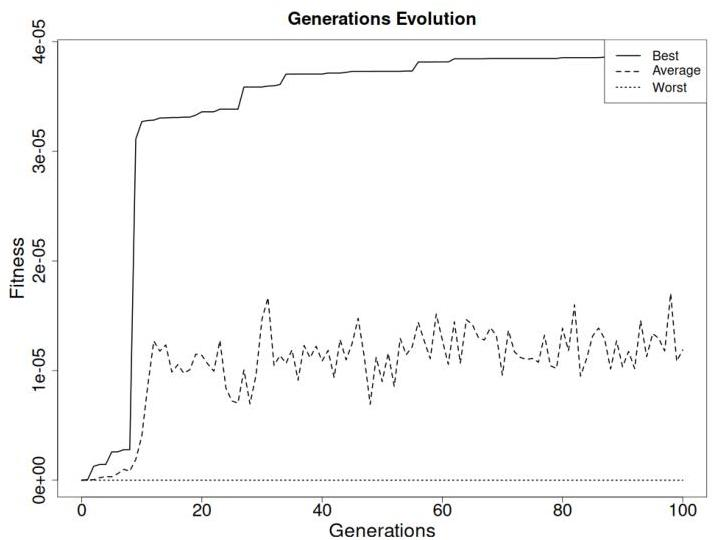

Aclarado esto, el valor de la fitness ha tenido un crecimiento rápido y continuado, alcanzando un valor máximo de 0.00003862.

Seguidamente, analizamos qué tanto ha evolucionado el robot en la realización de detectar un fuego e ir a por un extintor.

# Prueba 1

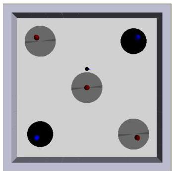

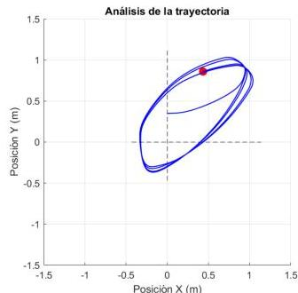

Por primera vez observamos un comportamiento distinto ante el escenario inicial. Aunque sigue realizando una diagonal, esta es más selectiva, haciendo caso únicamente a una luz roja y a una luz azul. Esto nos lleva a pensar que el E-puck ha evolucionado a verse más influenciado por las entradas de sus sensores de luz.

# Prueba 2

Para probar que efectivamente, el robot está más condicionado a la información que reciben sus sensores, vamos a eliminar la luz roja y el suelo gris que se encuentran en el centro del mapa.

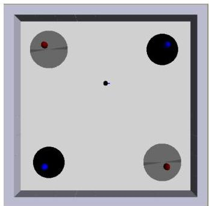

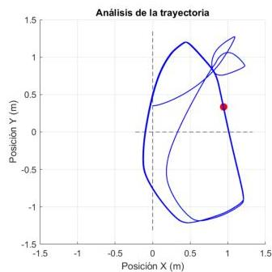

Notamos en la gráfica que analiza la trayectoria que el robot se dirige hacia otra luz de forma correcta, aunque el movimiento para llegar a las luces no sea del todo óptimo.

# Prueba 3

Con la finalidad de seguir analizando posibles fallos que tengan que ver con no localizar bien las luces, realizamos otra prueba que consiste en eliminar la luz y el suelo gris al que se dirige continuamente.

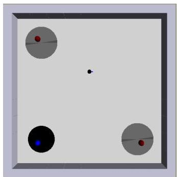

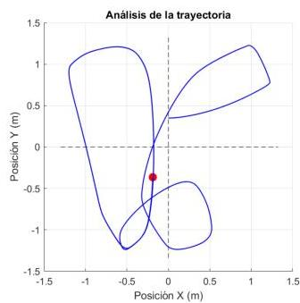

A pesar de que al principio le cuesta encontrar una luz azul, una vez que la encuentra, realiza correctamente los movimientos esperados, dirigiéndose de forma alterna hacia una luz azul y otra roja.

## Modificación 3

Ante el correcto funcionamiento y el poco estancamiento sufrido en la fitness, vamos a dejar que siga evolucionando sin realizar ningún tipo de modificaciones.

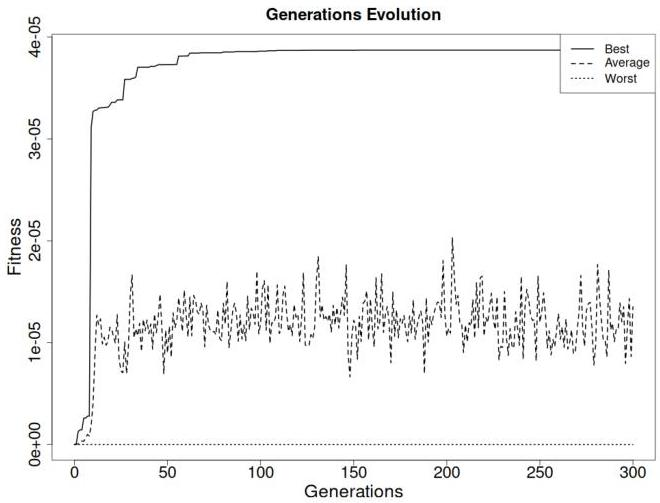

Evolucionamos 200 generaciones más hasta tener un total de 300. Al terminar la evolución y hacer un análisis de la fitness, notamos que se han producido múltiples estancamientos muy prolongados, alcanzando un valor máximo de fitness de 0.00003784. Esto supone un incremento mínimo respecto al valor del que partíamos.

Vamos a ver si el desempeño ha sido mejor.

## Prueba 1

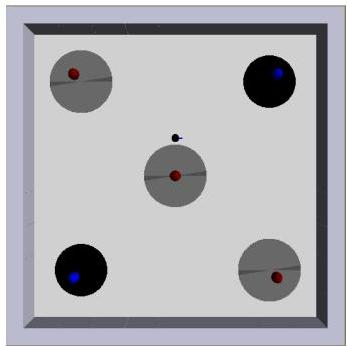

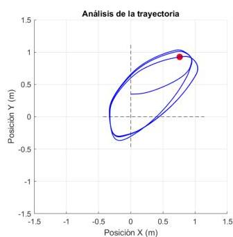

Para el escenario inicial, el comportamiento es el mismo que en la "Modificación 2".

## Prueba 2

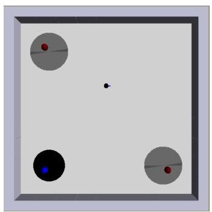

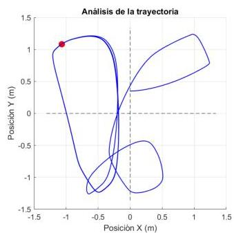

Al eliminar la luz roja del centro junto con su suelo gris, y la luz azul de arriba a la derecha junto con su suelo negro, se puede observar que el movimiento que realiza el robot es el esperado, busca nuevas fuentes de luz y va alternando entre una y otra.

## Prueba 3

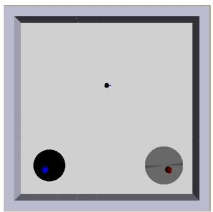

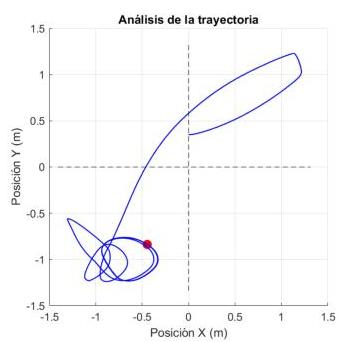

En esta última prueba que vamos a realizar sobre esta modificación, eliminaremos la luz roja y su suelo gris situado en la esquina superior izquierda para ver si el robot es capaz de ir hacia la luz roja situada en la esquina inferior derecha.

Como podemos ver, el E-puck no es capaz de dirigirse hacia la luz roja y se pone a dar vueltas sobre la luz azul.

## Modificación 4

Ante el estancamiento de la fitness, y al bajo rendimiento en la última prueba de la "Modificación 3", vamos a incrementar los parámetros tanto de la mutación como la del tamaño de población. La tasa de mutación la aumentaremos al 5% y la población a 75 individuos. Estos cambios provocarán una mayor diversidad tanto genética como de individuos.

Tras evolucionar 200 generaciones más, extraemos el siguiente análisis del valor de la fitness. El crecimiento en las primeras generaciones ha sido muy pronunciado, y aunque en las últimas se hayan producido estancamientos, la fitness ha alcanzado un valor de 0.00006641. Este valor es excelente puesto que casi ha duplicado la fitness de la que partíamos.

Analizamos el resultado de estas generaciones realizando las siguientes pruebas:

## Prueba 1

Para el escenario en el que el robot ha evolucionado, este realiza la misma trayectoria.

## Prueba 2

Si eliminamos la fuente de luz roja del centro con su suelo gris, el movimiento descrito es distinto al esperado (se puede apreciar en la gráfica de movimiento) pese a que resuelve bien el identificar nuevas fuentes de luz y dirigirse hacia ellas.

## Prueba 3

Al suprimir la luz roja y el suelo gris de la parte superior izquierda y la luz azul y su suelo negor de la parte superior derecha, en un inicio el E-Puck sí que logra alcanzar la zona gris, pero luego se queda dando vueltas sobre la luz azul sin dirigirse hacia la luz roja. Este comportamiento se aprecia de forma visual en la gráfica.

## Modificación 5

Con el objetivo de solventar este último comportamiento no deseado, vamos a probar a cambiar la función *fitness* para que sea menos restrictiva. El cambio que se plantea consiste en sustituir el valor de la media de los sensores de luz, por el valor máximo de estos a la hora de buscar una fuente de luz, de esta forma podemos conseguir que el robot se aproxime más a las fuentes de luz. En definitiva, con el cambio la función *fitness* se vería de esta forma:

$$
F = \frac {\sum_ {i = 0} ^ {N s t e p s} \left[ \left[ V \cdot \left(1 - \sqrt {\Delta V}\right) \cdot \left(1 - \max  \left\{I R _ {i} \right\}\right) \cdot \left(M _ {R} \cdot M _ {L}\right) \right] \cdot \left[ G M _ {O N} \cdot \left(\max  \left\{B L _ {i} \right\} - \left\{\binom {(\max  \{R L _ {i} \} - 0 . 5)} {0} \frac {s i \max  \{R L _ {i} \} > 0 . 9 3}{s i n o} \right\} \right] + G M _ {O F F} \cdot (\max  \{R L _ {i} \}) \right]}{N s t e p s} \cdot \left(\frac {F _ {o b j}}{2 0}\right)
$$

Tras seguir evolucionando 200 generaciones más, el resultado de la *fitness* obtenido es mucho mayor del que teníamos anteriormente, logrando alcanzar un valor máximo de 0.1144892. Esta diferencia es esperable puesto que la función que hemos empleado es significativamente menos restrictiva.

Ahora analizaremos el impacto que ha implicado el cambio de la función de *fitness* en el desempeño de la actividad del robot.

## Prueba 1

Para el escenario inicial, tenemos el mismo movimiento que en generaciones anteriores.

## Prueba 2

Se obtiene el mismo resultado que en las generaciones anteriores al eliminar la luz roja y el suelo gris del centro.

## Prueba 3

De igual manera, al eliminar la luz roja con el suelo gris de la parte superior izquierda, y la luz azul con su suelo nego de la parte superior derecha, obtenemos el mismo resultado que en la “Prueba 3” de la “Modificación 4”.

## Modificación 6

Al tener el mismo desempeño el E-puck en la “Modificación 4” que en la “Modificación 5”, y al tener una función fitness más restrictiva la “Modificación 4” lo que nos asegura individuos más óptimos, volvemos a la situación final de la “Modificación 4”.

Partiendo de esta base, vamos a intentar solventar los problemas que presentaba incrementando el tiempo de evaluación a 400, y dejando que el robot evolucione hasta completar 3500 generaciones.

Con estos cambios buscamos que la fitness incremente, y el desempeño del robot mejore.

La evolución de la fitness a lo largo de estas generaciones ha sido muy estancada. Sin embargo, se ha mejorado el resultado llegando a tener una fitness de 0.00008356.

Al aumentar la fitness, vamos a comprobar si ha mejorado también el desempeño del E-puck de tal forma que se ha solucionado el problema existente en la "Prueba 3" de la "Modificación 4"

## Prueba 1

Realizamos una breve comprobación de que el robot funcione correctamente ante el escenario inicial.

Notamos que la ejecución es correcta.

## Prueba 2

Finalmente, vamos a comprobar si ha sido capaz de evolucionar lo suficiente para solventar el problema que veníamos arrastrando. Para ello volvemos al supuesto en el que únicamente existen la luz roja y el suelo gris en la esquina inferior derecha, y la luz azul y el suelo negro en la esquina inferior izquierda.

Como se observa en la gráfica, realiza movimientos extraños, pero en esta ocasión sí que llega correctamente a ambas luces, cumpliendo así con el objetivo planteado.

## Observaciones

Tras evolucionar esta segunda red neuronal, podemos concluir que el cambio de red era necesaria, ya que hemos obtenido resultados mucho mejores con esta última que con la primera, además que esta segunda ha superado finalmente todas las pruebas de cambio de escenario que hemos planteado.

## Arquitectura artificial neuronal dinámica

Otro tipo de arquitecturas existentes en la robótica evolutiva son las dinámicas. Estas, a diferencia de las estáticas, tienen memoria del pasado, y pueden cambiar su comportamiento con el tiempo, permitiendo de esta forma a los robots adaptarse mejor a entornos cambiantes.

Un ejemplo de este tipo de arquitectura son las CTRNN (Continuous-Time Recurrent Neural Network), las cuales tienen conexiones recurrentes, es decir, las neuronas pueden enviarse señales entre sí y también hacia ellas mismas.

Para la implementación de una arquitectura artificial neuronal dinámica en este trabajo, emplearemos las CTRNN. Partiremos de la base de la segunda red neuronal vista en las arquitecturas estáticas, a la que le añadiremos conexiones internas entre las distintas capas sigmoides tal y como se puede ver en el diagrama de la red neuronal siguiente.

El tamaño del cromosoma se calcula sumando las siguientes componentes:

- $\omega = (8 \cdot 2) + (8 \cdot 4) + (1 \cdot 4) + (8 \cdot 4) + (4 \cdot 2) = 92$
- $\theta = 4 + 2 = 6$
- $\beta + \zeta = (4 \cdot 4) + 3 = 19$

Por lo que el tamaño del cromosoma es 117.

# Modificación 1

En la evolución vamos a partir de los siguientes parámetros:

- Population size = 50
- Evaluation time = 300
- Mutation rate = 0.05

Vamos a emplear la misma función fitness que hemos estado empleando para las arquitecturas estáticas.

Dejamos que evolucione hasta alcanzar las 1500 generaciones. Durante el transcurso de la evolución de estas generaciones notamos que la fitness sigue siendo baja aunque con un crecimiento progresivo como se puede observar en la siguiente gráfica, aunque podamos apreciar varios picos de bajada.

Ahora vamos a someter esta evolución a unas pruebas para poder observar el desempeño del robot tras haber sido evolucionado mediante una arquitectura dinámica.

# Prueba 1

Inicialmente analizamos el desempeño del robot en el escenario en el que se ha estado evaluando.

Observamos que realiza una nueva trayectoria, recorriendo de forma intercalada distintas luces rojas y azules, y sin tener ninguna colisión. Según esta prueba creemos que el robot está bien programado.

## Prueba 2

Vamos a realizar más pruebas para asegurarnos de que el funcionamiento del E-puck sea el correcto y no requiera de modificaciones. Para ello vamos a eliminar todas las luces por las que pasa a excepción de la luz azul con su suelo negro situado en la esquina inferior izquierda. De esta forma, solo tendremos esa luz azul, y la luz roja con su suelo gris en el origen de coordenadas.

El resultado de esta prueba nos indica que el robot ha aprendido una ruta, puesto que siempre realiza el mismo movimiento, si hacer caso alguno a la información que le proporcionan los sensores

## Modificación 2

Para que el robot aprenda a guiarse por los sensores de luz, vamos a hacer que para cada evaluación, el robot aparezca de forma completamente aleatoria dentro de una área delimitada.

Dejamos que evolucione unas 200 generaciones más, y volvemos a poner a prueba al robot para comprobar si esta vez sus movimientos se ven influenciados por la información que recogen los sensores de luz.

La fitness ha ido evolucionando de forma progresiva durante estas últimas 200 generaciones sin presentar ninguna caída drástica.

# Prueba 1

Al realizar nuevamente la ejecución en el escenario donde únicamente teníamos una luz roja con su suelo gris en el origen de coordenadas, y la luz azul con su suelo negro en la esquina inferior izquierda. Observamos que en las 200 generaciones con la random position activada, no ha sido capaz de aprender a emplear los sensores para guiarse.

# Observaciones

Tras esta última modificación notamos que para que el robot evolucione a mejor se le debería dejar que evolucione durante más generaciones, ya que con las últimas 200 no ha sido suficiente para que mejore la trayectoria del robot E-puck.

# Conclusiones

Lo más destacable entre la arquitectura dinámica respecto a la estática, es que hemos requerido de menos generaciones para alcanzar un valor fitness equivalente. Mientras que en la arquitectura estática hemos precisado de un total de 3500 generaciones, en la dinámica nos ha sobrado con 1500.

Otro aspecto a resaltar es la evolución del valor de esta fitness, mientras que en la estática se produjeron numerosos estancamientos prolongados en el tiempo, en la arquitectura dinámica no se ha producido ningún estancamiento.

No obstante, en cuanto al rendimiento que ha tenido una arquitectura comparada con la otra, la estática ha demostrado un desempeño significativamente superior al de la dinámica. Una de las razones por las cuales esto puede suceder, es que a la arquitectura dinámica la hemos dejado evolucionar durante muy pocas generaciones. Esto cobra aún una mayor relevancia cuando es la arquitectura dinámica la que requiere un mayor número de generaciones para poder producir un resultado óptimo, debido a la complejidad inherente de su arquitectura.

La arquitectura estática sí que se podría escalar a un entorno real, con unos sensores y actuadores más avanzados, pudiéndose en un futuro implementar en los servicios de emergencias si siguen cumpliendo con las especificaciones y comportamientos exigidos. No obstante, la arquitectura dinámica precisa aún de una mayor evolución para que sea viable la escalabilidad.
